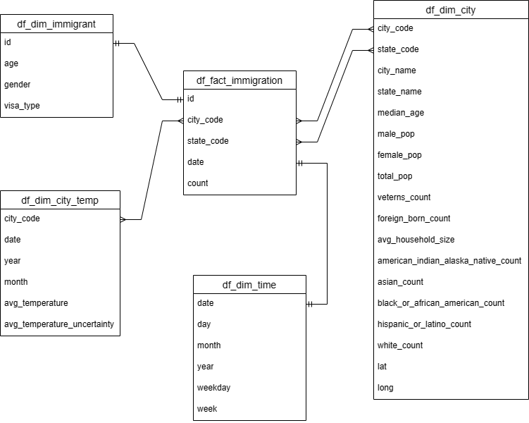

# ETL Pipeline using Spark to Model US Immigration Data

## Project Summary
The aim of this project is to create an ETL pipeline by reading in 3 sources sources of data  (the US I94 immigration data, U.S. city demographics data and temperature data) to create a STAR schema data model (dimension and fact tables) to allow for easier analysis of the immigration data. This data model will allow for various analyses to be carried out and will help to spot trends in the US immigration data, such as the most popular cities for immigration,the gender distribution of immigrants, the average age of immigrants etc.

The project follows the follow steps (these steps can be viewed in the notebook US_Immigration_Data.ipynb):
* Step 1: Scope the Project and Gather Data
* Step 2: Explore and Assess the Data
* Step 3: Define the Data Model
* Step 4: Run ETL to Model the Data
* Step 5: Complete Project Write Up

## Running the project:
To run the ETL pipeline:
- configure the file path locations in ``config.cfg``
- run ``python etl.py``

## Data sources:
1. I94 Immigration Data - This dataset contains immigration data from the US National Tourism and Trade Office. The I-94 is the Arrival/Departure Record, in either paper or electronic format, issued by a Customs and Border Protection (CBP) Officer to foreign visitors entering the United States. For this project we will be working with data from April 2016. (https://www.trade.gov/i-94-arrivals-historical-data)
2. World Temperature Data - This dataset came from Kaggle, and contains data on the average temperature of cities. (https://www.kaggle.com/datasets/berkeleyearth/climate-change-earth-surface-temperature-data)
3. U.S. City Demographic Data - This data comes from OpenSoft, and contains data on the demographics of US Cities such as gender, race, age etc. (https://public.opendatasoft.com/explore/dataset/us-cities-demographics/export/)

## Data Model

### ERD
<figure>
  
</figure>

### Staging Tables
df_staging_immigration
   - id
   - date
   - city_code
   - state_code
   - age
   - gender
   - visa_type
   - count

df_staging_temperature
   - year
   - month
   - city_code
   - city_name
   - avg_temperature
   - avg_temperature_uncertainty
   - lat
   - long

df_staging_demographics
   - city_code
   - state_code
   - city_name
   - median_age
   - male_pop
   - female_pop
   - total_pop
   - veterans_count
   - foreign_born_count
   - avg_household_size
   - american_indian_alaska_native_count
   - asian_count
   - black_or_african_american_count
   - hispanic_or_latino_count
   - white_count

### Dimension Tables
df_immigrant
   - id
   - age
   - gender
   - visa_type

df_city
   - city_code
   - state_code
   - city_name
   - state_name
   - median_age
   - male_pop
   - female_pop
   - total_pop
   - veterans_count
   - foreign_born_count
   - avg_household_size
   - american_indian_alaska_native_count
   - asian_count
   - black_or_african_american_count
   - hispanic_or_latino_count
   - white_count
   - lat
   - long

df_city_temp
   - city_code
   - date
   - year
   - month
   - avg_temperature
   - avg_temperature_uncertainty

df_time
  - date
  - day
  - month
  - year
  - weekday
  - week

### Fact Table
df_immigration
   - id
   - state_code
   - city_code
   - date
   - count

## Data Pipeline
##### Steps necessary to pipeline the data into the data model
1. Clean data sources
2. Load staging tables
3. Create dimension and fact tables
4. Save dimension and fact tables into parquet files which can then be used for analsyis

## Discussion and futire improvements
* Clearly state the rationale for the choice of tools and technologies for the project.
    - Apache spark was used for this project because of it's ability to handle multiple file formats with large amounts of data. Furthermore, spark can quickly perform processing tasks on very large data sets and has an easy-to-use API.
* Propose how often the data should be updated and why.
    - As the I94 immigration data is updated monthly, the other relevant datasets should also be updated monthly.
* Write a description of how you would approach the problem differently under the following scenarios:
 * The data was increased by 100x.
     - If the data was increased by 100x I would consider running Spark in the cloud rather than in local mode. Running Spark across a spark cluster on Amazon EMR would allow for much faster processing. Moreover, rather than loading the data into parquet files, I would load the data into a relational database which would allow for more convenient querying and analysis of the data.
 * The data populates a dashboard that must be updated on a daily basis by 7am every day.
     -  If this was the case I would use Apache Airflow to manage the ETL pipeline. This would allow for the data pipeline job to be scheduled and automated which would ensure that the pipeline runs on tim. Airflow also provides a convenient way of monitoring the ETL pipeline job.
 * The database needed to be accessed by 100+ people.
     - I would use a cloud database solution to store the data (e.g. Amazon Redshift), as this is easily scalable (both horizontally and vertically, with autoscaling available) and a load balancer can be used to help manage traffic, which would ensure that the data can be accessed by a large volume of people at once, while maintaining fast performance.
